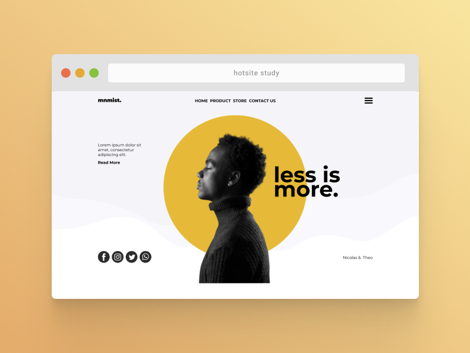

<h1 align="center">Hotsite Web Development Study 🔖</h1>

  This is a simple project made for studying how a Hotsite development works. Repository dedicated to store the study realized for the Web Design class of PUCPR.

  <a href="./LICENSE">License</a>

## 📄 License

Permissions of this strong copyleft license are conditioned on making available complete source code of licensed works and modifications, which include larger works using a licensed work, under the same license. Copyright and license notices must be preserved. Contributors provide an express grant of patent rights.

| Permissions | Restrictions | Conditions
| --- | --- | --- 
&check; Commercial Use | &times; Liability | &#x1f6c8; License and Copyright Notice
&check; Modification   | &times; Warranty | &#x1f6c8; State changes
&check; Distribution |  | &#x1f6c8; Disclose source
&check; Patent Use |  | &#x1f6c8; Same license
&check; Private Use
